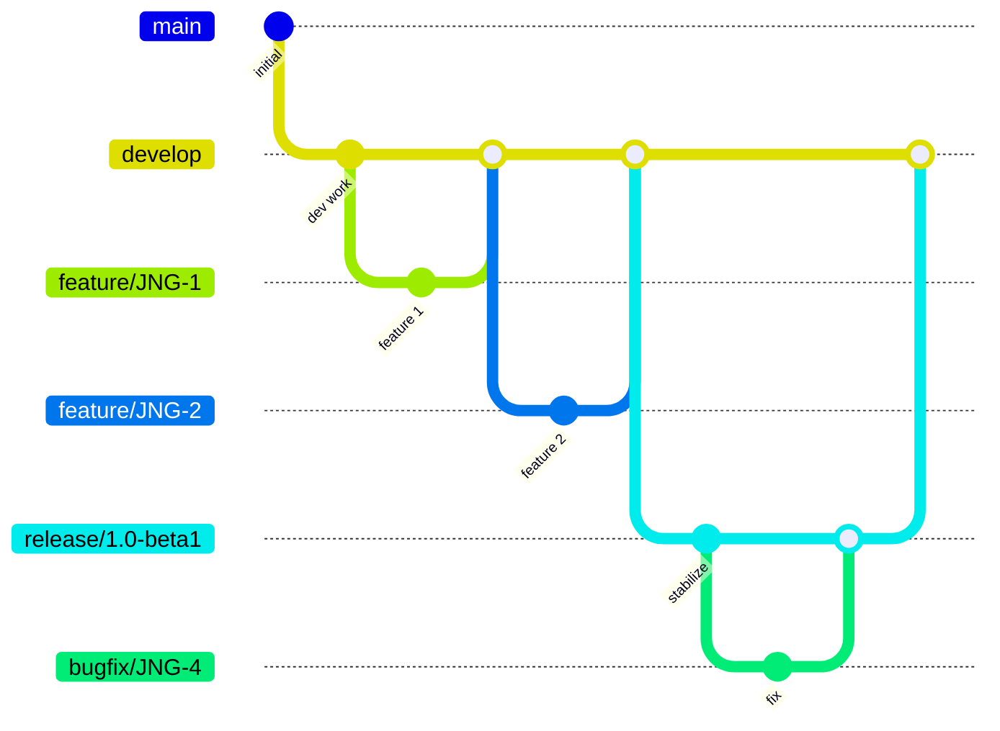
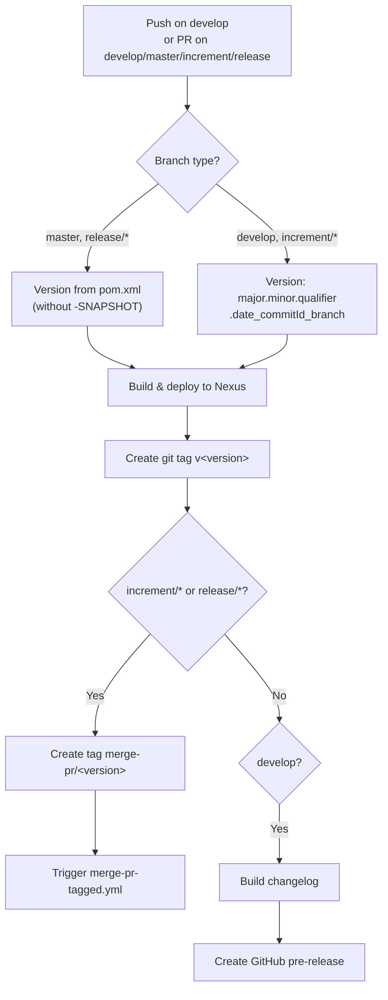
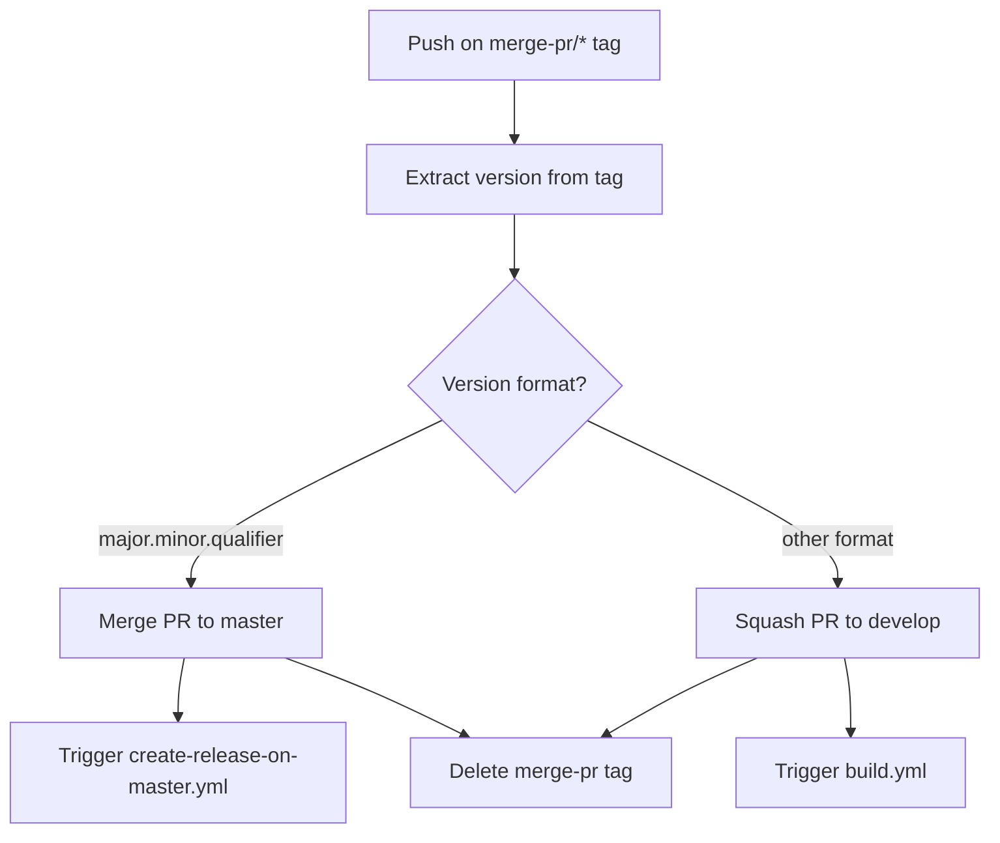
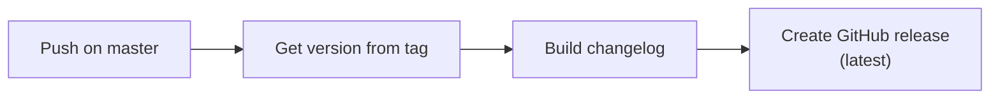
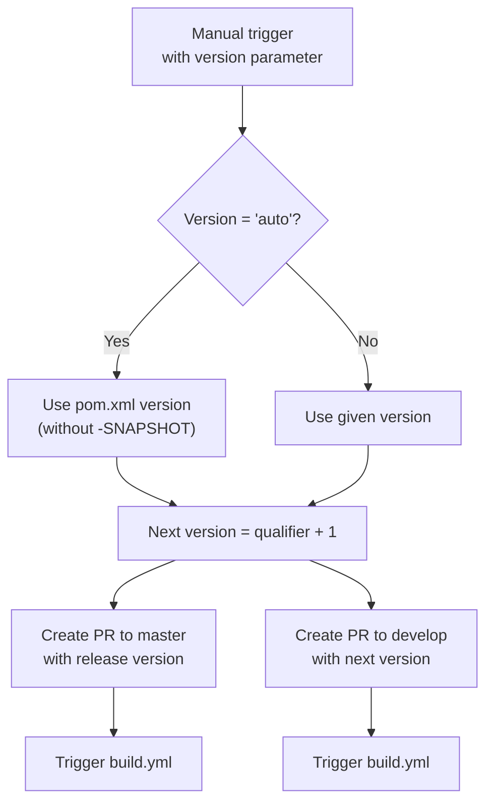

# Development Version and Branch Handling

## Branches

The versioning policy follows a GitFlow-based workflow. See [Atlassian's GitFlow guide](https://www.atlassian.com/git/tutorials/comparing-workflows/gitflow-workflow) for background.

| Branch pattern | Base | Purpose |
|---|---|---|
| `develop` | — | Main development branch with latest sources of the active version |
| `feature/JNG-NUMBER_summary` | `develop` | New features for the current version |
| `release/X.Y-betaN` or `X_Y_betaN` | `develop` | Release stabilization branches (the `release/` prefix is reserved for CI) |
| `bugfix/JNG-NUMBER_summary` | release branch | Bug fixes applied during release testing; must also be merged to newer release and develop branches |
| `support/JNG-NUMBER_summary` | release branch | Minor changes for a previous release; merged back to the release branch |
| `master` | — | Contains the latest released sources |
| `hotfix/JNG-NUMBER_summary` | `master` | Critical fixes applied to both release and master branches |

## Version Numbers

Versions follow semantic versioning with these rules:

| Event | Version change |
|-------|---------------|
| Start a `feature/` branch | No change — inherits from `develop` |
| Start a release branch from `develop` | 2nd number (minor) incremented on `develop` |
| Start a `bugfix/` branch | No change — fixes applied to release branch before merge to master |
| Start a `support/` branch | 3rd number (patch) incremented |
| Start a `hotfix/` branch | 4th number incremented |

## GitHub Actions Workflows

The CI/CD pipeline consists of four interconnected workflows:

### build.yml — Main Build Pipeline

Triggered on pushes to `develop` and pull requests targeting `develop`, `master`, `increment/*`, or `release/*`.

### merge-pr-tagged.yml — PR Merge Handler

Triggered when a `merge-pr/*` tag is pushed.

### create-release-on-master.yml — Release Creation

Triggered on pushes to `master`.

### release.yml — Manual Release Trigger

Manually triggered with a version parameter (`auto` or `major.minor.qualifier`).

## Development Rules

> **Important:** There is no commit without a ticket number. Every pull request and commit must reference a JIRA ticket in the format `JNG-xxx`.

Issue tracking: [BlackBelt JIRA](https://blackbelt.atlassian.net/jira/dashboards)
