# Contributing to OSGi Utils

## Prerequisites

OSGi Utils requires **Java 21** (Zulu JDK recommended) for compilation, targeting Java 17 at runtime. The project uses **Maven 3.8+** for dependency management and builds.

Verify your environment:

```bash
java -version
# Expected: openjdk version "21.x.x" ...

./mvnw -version
# Expected: Apache Maven 3.8.x or later
```

> **Note:** The project includes a Maven wrapper (`./mvnw`), so a local Maven installation is optional.

## Code Structure

This is a multi-module Maven project. Each module produces an OSGi bundle:

| Module | Package | Role |
|--------|---------|------|
| `osgi-api` | `hu.blackbelt.osgi.utils.osgi.api` | Public interfaces and utilities |
| `osgi-impl` | `hu.blackbelt.osgi.utils.internal.impl` | OSGi DS component implementations |
| `osgi-test` | `hu.blackbelt.osgi.utils.test` | Mock OSGi utilities for unit testing |
| `features` | — | Karaf feature descriptor |
| `kar` | — | Karaf KAR archive |
| `reports` | — | JaCoCo coverage aggregation |

## Commands

### Run Tests

```bash
./mvnw clean test
```

### Run Full Build

```bash
./mvnw clean install
```

### Run a Single Test

```bash
./mvnw test -pl osgi-impl -Dtest=BundleTrackerManagerImplTest
```

## Submitting an Issue

Before filing a new issue, search the [issue tracker](https://github.com/BlackBeltTechnology/osgi-utils/issues) — your problem may already be reported or resolved.

When reporting a bug, include:

- Output of `java -version` and `mvn -version`
- Relevant `pom.xml` or `.flattened-pom.xml`
- A minimal reproduction case that demonstrates the failure

A minimal reproduction helps maintainers confirm and fix the bug quickly. We will ask for one before investigating.

File new issues using the [issue form](https://github.com/BlackBeltTechnology/osgi-utils/issues/new/choose).

## Submitting a Pull Request

This project follows [GitHub's standard forking model](https://guides.github.com/activities/forking/). Fork the repository and submit pull requests from your fork.

For details on the CI/CD pipeline and how branches are handled, see the [CI Flow documentation](.github/CIFLOW.md).

## Build Lifecycle

The following diagram shows how Maven phases and key plugins interact during a build:

```mermaid
flowchart LR
    clean --> validate
    validate --> compile
    compile -->|lombok-maven-plugin| delombok[generate-sources<br/>delombok]
    delombok --> compile2[compile]
    compile2 -->|maven-bundle-plugin| manifest[process-classes<br/>OSGi manifest]
    manifest --> test
    test -->|maven-surefire-plugin| surefire[test execution<br/>JUnit 4 + Mockito]
    surefire --> package
    package -->|maven-bundle-plugin| bundle[OSGi bundle JAR]
    bundle --> verify
    verify -->|jacoco-maven-plugin| coverage[code coverage report]
    coverage --> install
    install --> deploy
```


