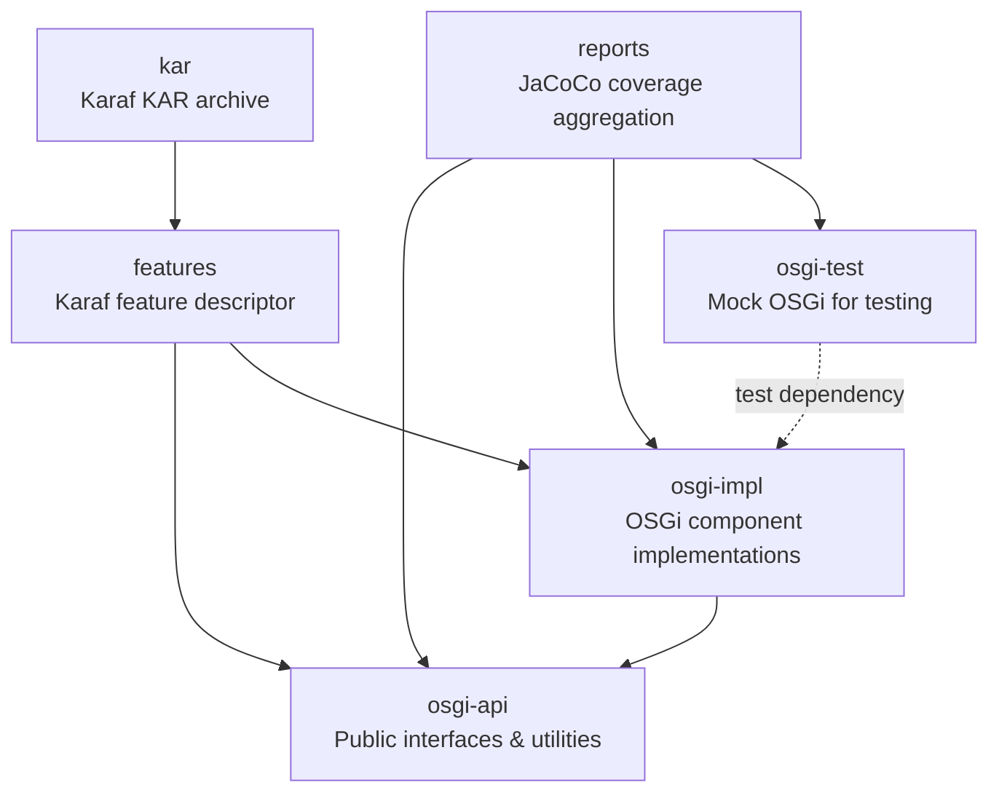
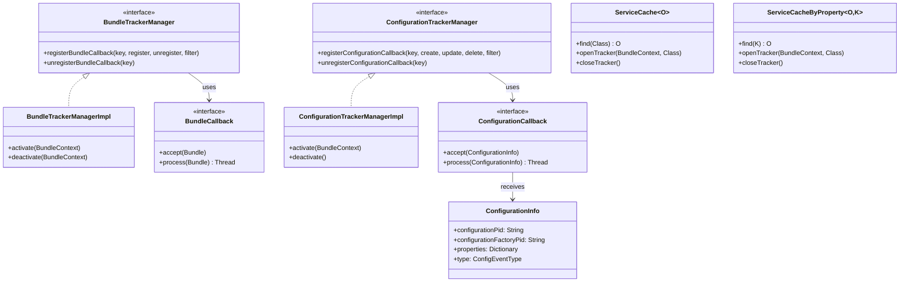
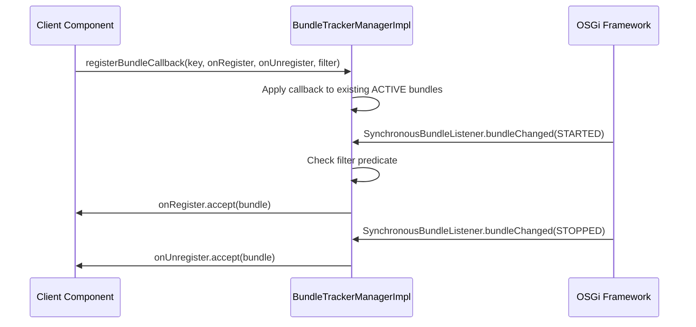
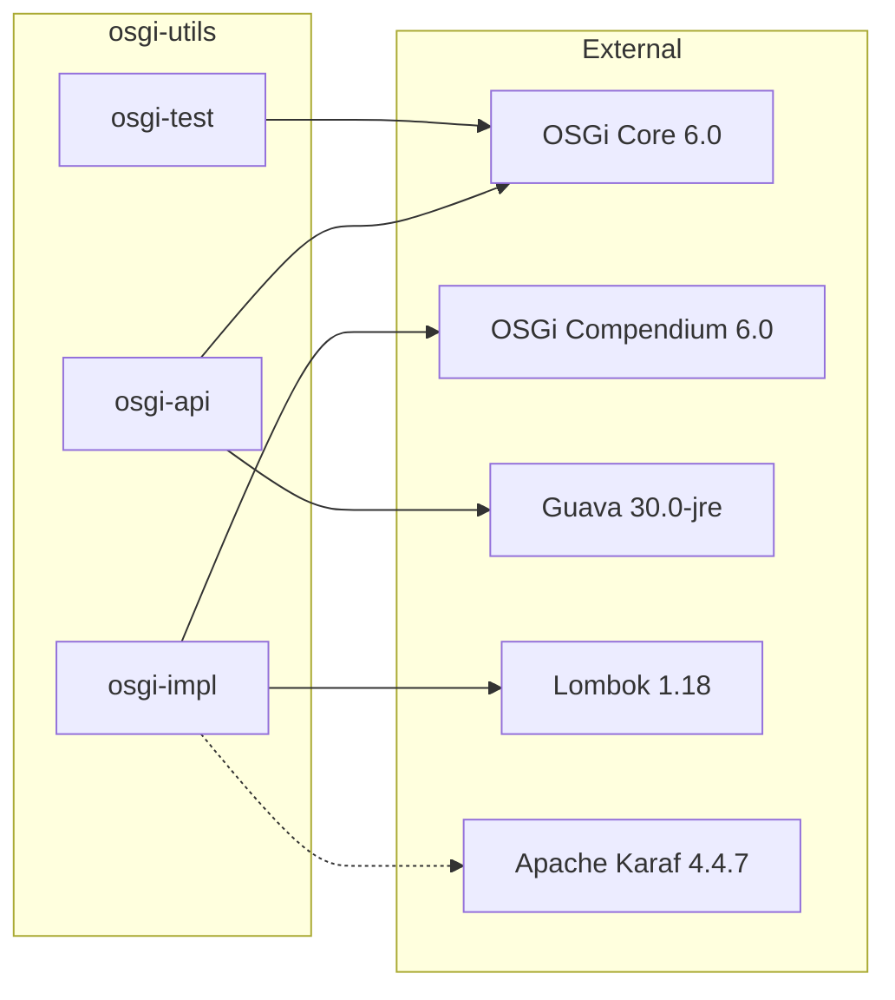

# OSGi Utils

[](https://github.com/BlackBeltTechnology/osgi-utils/actions/workflows/build.yml)

## Introduction

OSGi Utils is a utility library by [BlackBelt Technology](http://www.blackbelt.hu) that simplifies common tasks in OSGi-based applications. Rather than dealing with low-level OSGi APIs directly, this library provides higher-level abstractions for:

1. **Bundle lifecycle tracking** — register callbacks that fire when bundles start or stop, with optional filtering
2. **Configuration tracking** — monitor Configuration Admin changes (create/update/delete) with predicate-based filtering
3. **Service caching** — maintain ranked caches of OSGi services, indexed by class or custom properties
4. **Bundle utilities** — parse manifest headers, extract bundle resources to persistent storage, delegate class loading to bundles
5. **Testing support** — mock OSGi component lifecycle (activate/deactivate/bind/unbind) without a running container

## Module Overview



| Module | Packaging | Description |
|--------|-----------|-------------|
| `osgi-api` | bundle | Public API: interfaces (`BundleTrackerManager`, `ConfigurationTrackerManager`, `ClassBasedCache`), utilities (`BundleUtil`, `PropertiesUtil`), service caching (`ServiceCache`, `ServiceCacheByProperty`), and data types (`ConfigurationInfo`) |
| `osgi-impl` | bundle | OSGi DS components: `BundleTrackerManagerImpl` (synchronous bundle listener), `ConfigurationTrackerManagerImpl` (synchronous configuration listener), `OsgiUtil` |
| `osgi-test` | bundle | `MockOsgi` — activates/deactivates components, binds/unbinds `@Reference` fields via reflection. `BeanUtil` — reflection helpers for test setup |
| `features` | feature | Karaf feature descriptor pulling in `osgi-api`, `osgi-impl`, `guava-30`, and `scr` |
| `kar` | kar | Packages the Karaf feature into a deployable KAR archive |
| `reports` | pom | Aggregates JaCoCo code coverage across all modules |

## Key API Components

The following diagram shows the primary public interfaces and classes, and how the implementation module connects to them:



## Runtime Interaction

A typical flow when a component registers for bundle tracking:



## External Dependencies



## Build

The project uses Maven with a wrapper script. Java 21 is required to compile (targets Java 17 runtime).

```bash
# Full build
./mvnw clean install

# Tests only
./mvnw clean test

# Single test class
./mvnw test -pl osgi-impl -Dtest=BundleTrackerManagerImplTest

# Skip tests
./mvnw clean install -DskipTests
```

### Maven Profiles

| Profile | Purpose |
|---------|---------|
| `modules` | Active by default — includes all submodules |
| `sign-artifacts` | GPG-sign artifacts for release |
| `release-dummy` | Deploy to local filesystem (for testing) |
| `release-judong` | Deploy to JuDong Nexus repository |
| `release-central` | Deploy to Maven Central via OSSRH |
| `generate-github-asciidoc-diagrams` | Generate PNG diagrams from AsciiDoc/PlantUML |
| `update-source-code-license` | Update Apache 2.0 license headers in source files |

## Contributing

Everyone is welcome to contribute. Please see [CONTRIBUTING.md](CONTRIBUTING.md) for guidelines on submitting issues and pull requests.

## License

This project is licensed under the [Apache License 2.0](http://www.apache.org/licenses/LICENSE-2.0).
